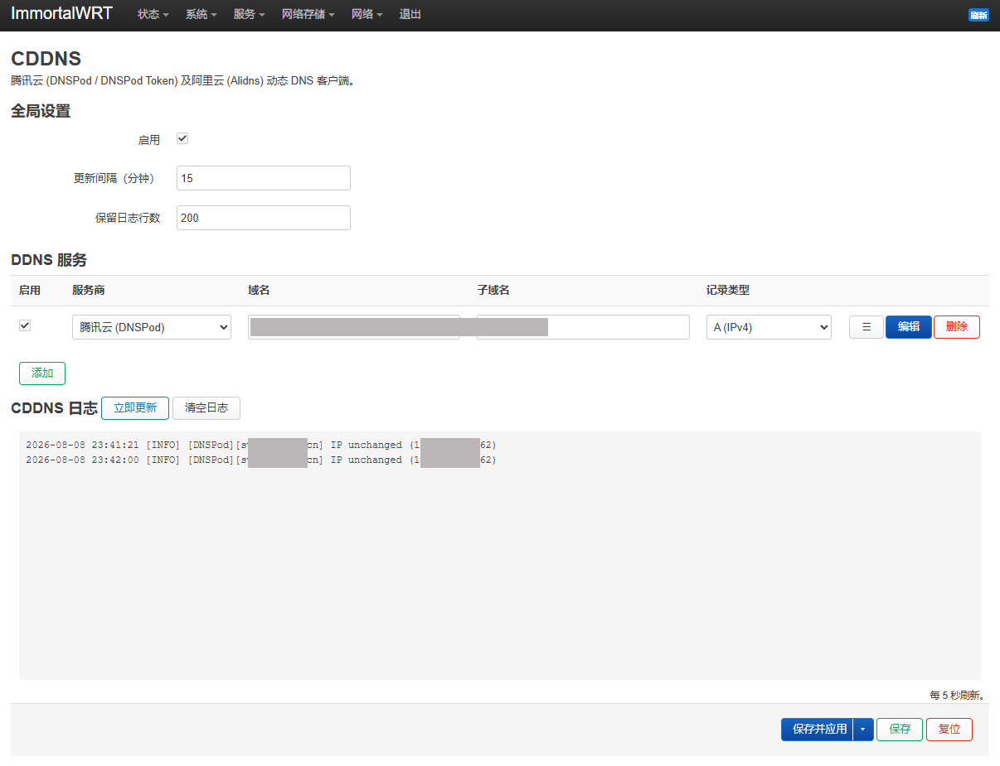

# luci-app-cddns

OpenWrt/ImmortalWrt 腾讯云 (DNSPod / DNSPod Token) 及阿里云 (Alidns) 动态 DNS 插件。

- 前端 100% JS（`form.js` + `view.js`）
- 菜单、ACL 均为 JSON 声明式文件
- 后端为纯 POSIX shell（`ash` 兼容），自行实现两家 API 调用
  - 腾讯云：TC3-HMAC-SHA256（API 3.0，DNSPod 服务）— 适用于 CAM API 密钥
  - DNSPod 旧版：Token 认证（`dnsapi.cn`）— 适用于旧版 DNSPod Token，无签名，自动识别
  - 阿里云：HMAC-SHA1（Alidns 2015-01-09）
- 页面底部内置日志查看器（每 5 秒轮询 `/var/log/cddns.log`），支持手动立即更新 / 清空日志
- 支持中文 / 英文界面（OpenWrt 语言设置自动切换）

## 界面截图

## 版本兼容性

| OpenWrt 版本 | LuCI 界面 | 后端脚本 | 说明 |
|---|---|---|---|
| 19.07 及之前 | ❌ | ✅ | 前端依赖 LuCI JS 框架（21.02 引入），不支持旧版 Lua MVC |
| **23.05 ~ 25.12** | ✅ | ✅ | 完全兼容 |

## 编译方法（OpenWrt SDK / Buildroot）

1. 将本目录放入 `package/luci-app-cddns`（或加入自定义 feed 后 `./scripts/feeds install luci-app-cddns`）。
2. `make menuconfig` → `LuCI` → `Applications` → 勾选 `luci-app-cddns`。
3. `make package/luci-app-cddns/compile V=s` 生成 ipk。

## 配置说明

- 全局：是否启用、更新间隔（可选 5/10/15/20/30/60 分钟，默认 15）、日志保留行数
- 每条 DDNS 记录：服务商（腾讯云/阿里云）、域名、子域名、记录类型（A/AAAA）、
  IP 来源（网络接口 / URL / 自定义）、SecretId / Token ID、SecretKey / Token
- AAAA（IPv6）记录：IP 来源为"网络接口"时，接口请填承载公网 IPv6 的接口
  （如 `wan6`）；若接口取不到地址，可改用 URL 来源（默认查询 `6.ipw.cn`）
- 最多添加 5 个 DDNS 服务（前端与后端均限制）
- IP 未变化时输出 `[INFO] ... IP unchanged` 日志，不执行更新
  （仍会查询远端记录以保持一致性）

腾讯云支持两种认证方式（自动识别，无需手动切换）：
- **CAM API 密钥**：前往 [API 密钥管理](https://console.cloud.tencent.com/cam/capi) 创建，SecretId 以 `AKID` 开头，需 DNSPod 权限
- **旧版 DNSPod Token**：前往 [DNSPod 控制台 - 密钥管理](https://console.dnspod.cn/account/token/apikey) 创建，ID 和 Token 均为数字

阿里云需前往 [RAM 访问控制](https://ram.console.aliyun.com/manage/ak) 创建 AccessKey，并授予 `AliyunDNSFullAccess` 权限。
